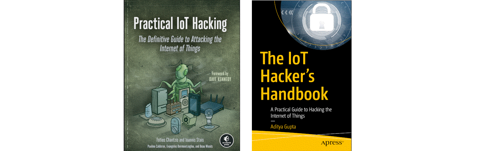

A vast amphibious wilderness of swamp and forest
==============================================

Identify, assess, and exploit basic and complex security mechanisms in IoT devices.

----

----

.. toctree::
   :glob:
   :maxdepth: 1
   :includehidden:
   :caption: IoT threat landscape

   docs/landscape/README.md

.. toctree::
   :glob:
   :maxdepth: 1
   :includehidden:
   :caption: Network hacking

   docs/network/README.md

.. toctree::
   :glob:
   :maxdepth: 1
   :includehidden:
   :caption: Hardware hacking

   docs/hardware/README.md

.. toctree::
   :glob:
   :maxdepth: 1
   :includehidden:
   :caption: Radio hacking

   docs/radio/README.md

.. toctree::
   :glob:
   :maxdepth: 1
   :includehidden:
   :caption: Targeting the ecosystem

   docs/ecosystem/README.md

.. toctree::
   :caption: Links

   Red Team <https://red.tymyrddin.dev/>
